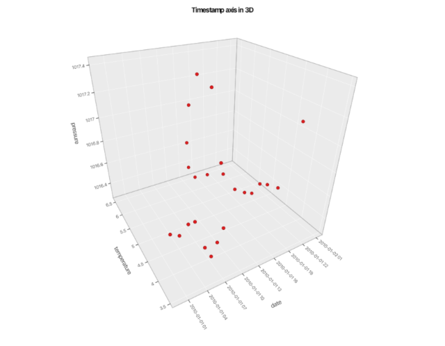

# gog4j — Example Gallery

Every figure below is rendered by [`org.jtaccuino.gog.dflib.apps.PlotExporter`](../gog4j-examples-dflib/src/main/java/org/jtaccuino/gog/dflib/apps/PlotExporter.java) from the example sources, in both raster and vector form.

**Click any figure to open it as SVG** — scalable, editable, and readable directly in the browser. The thumbnails below keep this page light; each caption also links the full-size PNG.

Regenerate everything, this page included, with:

```bash
./gradlew :gog4j-examples-dflib:exportDocs
```

## Contents

- [`Geoms.point()`](#geomspoint) — 8 figures
- [`Geoms.smooth()`](#geomssmooth) — 11 figures
- [`Stats.smooth()`](#statssmooth) — 4 figures
- [`Stats.bin()`/`Stats.summary()`](#statsbinstatssummary) — 5 figures
- [`Geoms.line()`](#geomsline) — 5 figures
- [`ColumnType.TIMESTAMP`](#columntypetimestamp) — 5 figures
- [`Geoms.bar()`](#geomsbar) — 2 figures
- [`Geoms.col()`](#geomscol) — 12 figures
- [`Geoms.bar()` vs `Geoms.col()`](#geomsbar-vs-geomscol) — 5 figures
- [`Geoms.area()`](#geomsarea) — 1 figure
- [`Geoms.boxplot()`](#geomsboxplot) — 7 figures
- [`Geoms.jitter()`](#geomsjitter) — 5 figures
- [`Geoms.violin()`](#geomsviolin) — 10 figures
- [`Geoms.density()`](#geomsdensity) — 10 figures
- [`Geoms.density2d()`](#geomsdensity2d) — 7 figures
- [`Geoms.function()`](#geomsfunction) — 8 figures
- [`Geoms.tile()`](#geomstile) — 2 figures
- [`Geoms.point3d()`](#geomspoint3d) — 3 figures
- [`Geoms.segment3d()`, `Geoms.path3d()`, `Geoms.text3d()`](#geomssegment3d-geomspath3d-geomstext3d) — 6 figures
- [`Geoms.surface3d()`, `Geoms.function3d()`, `Geoms.density3d()`, `Geoms.ridgeline3d()`, `Geoms.contour3d()`, `Geoms.smooth3d()`](#geomssurface3d-geomsfunction3d-geomsdensity3d-geomsridgeline3d-geomscontour3d-geomssmooth3d) — 8 figures
- [`Geoms.col3d()`, `Geoms.bar3d()`, `Geoms.voxel3d()`, `Geoms.hull3d()`](#geomscol3d-geomsbar3d-geomsvoxel3d-geomshull3d) — 8 figures
- [`light(...)`](#light) — 16 figures
- [`Positions.positionOnFace()`](#positionspositiononface) — 3 figures
- [`Coords.coord3d()`](#coordscoord3d) — 16 figures
- [The `coord3d()` view-control figures](#the-coord3d-view-control-figures) — 11 figures
- [`plot3d()`/`ggplot3d()`](#plot3dggplot3d) — 3 figures
- [`Orbit3d`](#orbit3d) — 4 figures
- [`Geoms.hline()`, `Geoms.vline()`, `Geoms.abline()`, `Geoms.text()`](#geomshline-geomsvline-geomsabline-geomstext) — 15 figures
- [guides](#guides) — 26 figures
- [scales](#scales) — 12 figures
- [`Facets.grid()`](#facetsgrid) — 12 figures
- [`coordPolar()`](#coordpolar) — 29 figures
- [`Plot#layer(...)`](#plotlayer) — 4 figures
- [`coordEqual()` and `coordTrans()`](#coordequal-and-coordtrans) — 2 figures
- [`annotate()`](#annotate) — 3 figures
- [ticks & grid](#ticks--grid) — 4 figures
- [`matrixPlot()`](#matrixplot) — 13 figures
- [`composedPlot()`](#composedplot) — 10 figures

## `Geoms.point()`

`Geoms.point()` — scatter plots, with colour, shape, and opacity mapped from data.

|   |   |
|---|---|
| [](images/anscombe-1-raw-scatter.svg)<br>**Anscombe's quartet, plotted raw**<br>[SVG](images/anscombe-1-raw-scatter.svg) · [PNG](images/anscombe-1-raw-scatter.png) | [](images/anscombe-2-colour-mapped.svg)<br>**The same data with colour mapped to the dataset**<br>[SVG](images/anscombe-2-colour-mapped.svg) · [PNG](images/anscombe-2-colour-mapped.png) |
| [](images/diamonds-01-scatter.svg)<br>**54,000 diamonds: price against carat**<br>[SVG](images/diamonds-01-scatter.svg) · [PNG](images/diamonds-01-scatter.png) | [](images/diamonds-02-by-clarity.svg)<br>**Colour mapped to clarity, eight categories**<br>[SVG](images/diamonds-02-by-clarity.svg) · [PNG](images/diamonds-02-by-clarity.png) |
| [](images/diamonds-07-alpha.svg)<br>**Opacity 0.15 to reveal density in overplotted regions**<br>[SVG](images/diamonds-07-alpha.svg) · [PNG](images/diamonds-07-alpha.png) | [](images/diamonds-04-facet-colour.svg)<br>**Faceted by colour grade**<br>[SVG](images/diamonds-04-facet-colour.svg) · [PNG](images/diamonds-04-facet-colour.png) |
| [](images/diamonds-08-facet-clarity-cut.svg)<br>**Faceted by clarity, coloured by cut**<br>[SVG](images/diamonds-08-facet-clarity-cut.svg) · [PNG](images/diamonds-08-facet-clarity-cut.png) | [](images/mpg-06-dual-aesthetics.svg)<br>**Colour and shape mapped to the same variable**<br>[SVG](images/mpg-06-dual-aesthetics.svg) · [PNG](images/mpg-06-dual-aesthetics.png) |

## `Geoms.smooth()`

`Geoms.smooth()` — LOESS and linear-model trend lines, with optional confidence bands.

|   |   |
|---|---|
| [](images/mpg-01-smooth-loess.svg)<br>**LOESS conditional mean with confidence band**<br>[SVG](images/mpg-01-smooth-loess.svg) · [PNG](images/mpg-01-smooth-loess.png) | [](images/mpg-02-smooth-span.svg)<br>**A tighter bandwidth, span = 0.3**<br>[SVG](images/mpg-02-smooth-span.svg) · [PNG](images/mpg-02-smooth-span.png) |
| [](images/mpg-03-smooth-no-se.svg)<br>**Linear model without the confidence band**<br>[SVG](images/mpg-03-smooth-no-se.svg) · [PNG](images/mpg-03-smooth-no-se.png) | [](images/mpg-04-linear-models.svg)<br>**One linear model per drive type**<br>[SVG](images/mpg-04-linear-models.svg) · [PNG](images/mpg-04-linear-models.png) |
| [](images/mpg-05-local-smooth.svg)<br>**Global points with a per-group trend via local aesthetics**<br>[SVG](images/mpg-05-local-smooth.svg) · [PNG](images/mpg-05-local-smooth.png) | [](images/mpg-08-two-local-smooth.svg)<br>**Two smooth layers, each with its own per-geom colour mapping**<br>[SVG](images/mpg-08-two-local-smooth.svg) · [PNG](images/mpg-08-two-local-smooth.png) |
| [](images/anscombe-3-faceted.svg)<br>**The quartet faceted, each with its own regression**<br>[SVG](images/anscombe-3-faceted.svg) · [PNG](images/anscombe-3-faceted.png) | [](images/diamonds-05-smooth-loess.svg)<br>**LOESS over 54,000 observations**<br>[SVG](images/diamonds-05-smooth-loess.svg) · [PNG](images/diamonds-05-smooth-loess.png) |
| [](images/diamonds-06-smooth-linear.svg)<br>**Linear model over the same data**<br>[SVG](images/diamonds-06-smooth-linear.svg) · [PNG](images/diamonds-06-smooth-linear.png) | [](images/diamonds-03-facet-clarity.svg)<br>**Faceted by clarity, each panel smoothed**<br>[SVG](images/diamonds-03-facet-clarity.svg) · [PNG](images/diamonds-03-facet-clarity.png) |
| [](images/meat-1-trend-line.svg)<br>**Square points with a linear trend over a date axis**<br>[SVG](images/meat-1-trend-line.svg) · [PNG](images/meat-1-trend-line.png) | |

## `Stats.smooth()`

`Stats.smooth()` — the statistical transformation behind the smoother, used directly as a pure data transform.

|   |   |
|---|---|
| [](images/stat-01-loess.svg)<br>**StatSmooth.fit(): LOESS (span = 0.6), drawn straight from the returned StatData**<br>[SVG](images/stat-01-loess.svg) · [PNG](images/stat-01-loess.png) | [](images/stat-02-lm.svg)<br>**StatSmooth.fit(): linear model, a straight least-squares line**<br>[SVG](images/stat-02-lm.svg) · [PNG](images/stat-02-lm.png) |
| [](images/stat-03-span.svg)<br>**StatSmooth.fit(): LOESS span = 0.3 — a wigglier curve from the same stat**<br>[SVG](images/stat-03-span.svg) · [PNG](images/stat-03-span.png) | [![StatSmooth.fit(): fullrange extrapolation evaluated over [0, 6.5]](images/thumbs/stat-04-fullrange.png)](images/stat-04-fullrange.svg)<br>**StatSmooth.fit(): fullrange extrapolation evaluated over [0, 6.5]**<br>[SVG](images/stat-04-fullrange.svg) · [PNG](images/stat-04-fullrange.png) |

## `Stats.bin()`/`Stats.summary()`

`Stats.bin()`/`Stats.summary()` — aggregated distributions and ranges: `Geoms.histogram()`, `Geoms.freqpoly()`, and the error/range family (`Geoms.errorbar()`, `Geoms.crossbar()`, `Geoms.pointrange()`, `Geoms.ribbon()`).

|   |   |
|---|---|
| [](images/summary-01-histogram.svg)<br>**Geoms.histogram() — Stats.bin() over a bell-shaped score**<br>[SVG](images/summary-01-histogram.svg) · [PNG](images/summary-01-histogram.png) | [](images/summary-02-freqpoly.svg)<br>**Geoms.freqpoly() — two distributions, one line per group**<br>[SVG](images/summary-02-freqpoly.svg) · [PNG](images/summary-02-freqpoly.png) |
| [](images/summary-03-pointrange.svg)<br>**Geoms.pointrange() — Stats.summary mean ± sd per group**<br>[SVG](images/summary-03-pointrange.svg) · [PNG](images/summary-03-pointrange.png) | [](images/summary-04-errorbar-crossbar.svg)<br>**Geoms.errorbar() whiskers over Geoms.crossbar() boxes**<br>[SVG](images/summary-04-errorbar-crossbar.svg) · [PNG](images/summary-04-errorbar-crossbar.png) |
| [](images/summary-05-ribbon.svg)<br>**Geoms.ribbon() — a standalone uncertainty band**<br>[SVG](images/summary-05-ribbon.svg) · [PNG](images/summary-05-ribbon.png) | |

## `Geoms.line()`

`Geoms.line()` — connected time series, optionally averaged.

|   |   |
|---|---|
| [](images/meat-2-multiple-trends.svg)<br>**One series per animal, colour mapped**<br>[SVG](images/meat-2-multiple-trends.svg) · [PNG](images/meat-2-multiple-trends.png) | [](images/meat-3-faceted.svg)<br>**The same series faceted into small multiples**<br>[SVG](images/meat-3-faceted.svg) · [PNG](images/meat-3-faceted.png) |
| [](images/linetype-01-line-group-dashes.svg)<br>**linetype maps the group: each drive type is a distinct dash**<br>[SVG](images/linetype-01-line-group-dashes.svg) · [PNG](images/linetype-01-line-group-dashes.png) | [](images/linetype-02-color-and-line.svg)<br>**colour + linetype on the same column; legend keys carry the dash**<br>[SVG](images/linetype-02-color-and-line.svg) · [PNG](images/linetype-02-color-and-line.png) |
| [](images/linetype-03-smooth-dashed.svg)<br>**dashed per-group linear trend lines with a matching legend**<br>[SVG](images/linetype-03-smooth-dashed.svg) · [PNG](images/linetype-03-smooth-dashed.png) | |

## `ColumnType.TIMESTAMP`

`ColumnType.TIMESTAMP` — a timestamp axis, whose break ladder adapts from months across a year down to hours across a day, in normal, flipped, and filled geometries.

|   |   |
|---|---|
| [](images/seattle-weather-01-yearly-temperature.svg)<br>**Hourly temperature over a year — the timestamp axis breaks the span by month**<br>[SVG](images/seattle-weather-01-yearly-temperature.svg) · [PNG](images/seattle-weather-01-yearly-temperature.png) | [](images/seattle-weather-02-daily-pressure.svg)<br>**Pressure over a single day — the timestamp axis narrows to hourly breaks**<br>[SVG](images/seattle-weather-02-daily-pressure.svg) · [PNG](images/seattle-weather-02-daily-pressure.png) |
| [](images/seattle-weather-03-flipped.svg)<br>**A timestamp column on the y axis — the same break ladder under `coordFlip()`**<br>[SVG](images/seattle-weather-03-flipped.svg) · [PNG](images/seattle-weather-03-flipped.png) | [](images/seattle-weather-04-area.svg)<br>**A filled temperature envelope over the year**<br>[SVG](images/seattle-weather-04-area.svg) · [PNG](images/seattle-weather-04-area.png) |
| [](images/seattle-weather-05-3d-timestamp.svg)<br>**A timestamp axis on a 3D cube — the date breaks and labels in calendar terms**<br>[SVG](images/seattle-weather-05-3d-timestamp.svg) · [PNG](images/seattle-weather-05-3d-timestamp.png) | |

## `Geoms.bar()`

`Geoms.bar()` — bars whose heights are the observation counts per x category (`Stats.count()`), plus computed `afterStat()` fills.

|   |   |
|---|---|
| [](images/bar-01-class-count.svg)<br>**`Geoms.bar()` counts the rows per class — the bar height is the count**<br>[SVG](images/bar-01-class-count.svg) · [PNG](images/bar-01-class-count.png) | [](images/bar-02-cyl-count.svg)<br>**`Geoms.bar()` fill = `afterStat(count)` — bars coloured by their count**<br>[SVG](images/bar-02-cyl-count.svg) · [PNG](images/bar-02-cyl-count.png) |

## `Geoms.col()`

`Geoms.col()` — columns whose heights are the values in the data, stacked, dodged, and horizontal.

|   |   |
|---|---|
| [](images/meat-4-bar-chart.svg)<br>**Dodged columns comparing production**<br>[SVG](images/meat-4-bar-chart.svg) · [PNG](images/meat-4-bar-chart.png) | [](images/meat-5-horizontal-bars.svg)<br>**The same columns under `coordFlip()`**<br>[SVG](images/meat-5-horizontal-bars.svg) · [PNG](images/meat-5-horizontal-bars.png) |
| [](images/meat-6-dodge-bars.svg)<br>**Horizontal columns, dodged by group**<br>[SVG](images/meat-6-dodge-bars.svg) · [PNG](images/meat-6-dodge-bars.png) | [](images/meat-8-stacked-bars.svg)<br>**Stacked columns accumulating total production**<br>[SVG](images/meat-8-stacked-bars.svg) · [PNG](images/meat-8-stacked-bars.png) |
| [](images/mtcars-faceted-stacked-bars.svg)<br>**Faceted, stacked columns — cars by gears, stacked by transmission**<br>[SVG](images/mtcars-faceted-stacked-bars.svg) · [PNG](images/mtcars-faceted-stacked-bars.png) | [](images/mpg-col-01-basic.svg)<br>**Columns whose heights are the values in the data — `Geoms.col()` leaves the data as is**<br>[SVG](images/mpg-col-01-basic.svg) · [PNG](images/mpg-col-01-basic.png) |
| [](images/mpg-col-02-points.svg)<br>**The same values as points, which need no zero baseline**<br>[SVG](images/mpg-col-02-points.svg) · [PNG](images/mpg-col-02-points.png) | [](images/mpg-col-03-stacked.svg)<br>**Stacked columns — mean mileage by class, split and piled by drive type**<br>[SVG](images/mpg-col-03-stacked.svg) · [PNG](images/mpg-col-03-stacked.png) |
| [](images/mpg-col-04-dodged.svg)<br>**Dodged columns — the drive-type segments side by side**<br>[SVG](images/mpg-col-04-dodged.svg) · [PNG](images/mpg-col-04-dodged.png) | [](images/mpg-col-04b-dodge-width.svg)<br>**Dodged columns with an explicit `Positions.dodge(width = 0.5)`**<br>[SVG](images/mpg-col-04b-dodge-width.svg) · [PNG](images/mpg-col-04b-dodge-width.png) |
| [](images/diamonds-col-05-horizontal.svg)<br>**Horizontal columns — mean diamond price per cut under `coordFlip()`**<br>[SVG](images/diamonds-col-05-horizontal.svg) · [PNG](images/diamonds-col-05-horizontal.png) | [](images/meat-col-06-time-axis.svg)<br>**Columns over a time axis — total annual meat production**<br>[SVG](images/meat-col-06-time-axis.svg) · [PNG](images/meat-col-06-time-axis.png) |

## `Geoms.bar()` vs `Geoms.col()`

`Geoms.bar()` vs `Geoms.col()` — the `Stats.count()`/`Stats.identity()` split and how each geometry can be overridden to the other's statistic.

|   |   |
|---|---|
| [](images/barc-stats-01-bar-counts.svg)<br>**`Geoms.bar()` runs `Stats.count()` — count the rows per cylinder**<br>[SVG](images/barc-stats-01-bar-counts.svg) · [PNG](images/barc-stats-01-bar-counts.png) | [](images/barc-stats-02-col-values.svg)<br>**`Geoms.col()` runs `Stats.identity()` — the y values are the heights**<br>[SVG](images/barc-stats-02-col-values.svg) · [PNG](images/barc-stats-02-col-values.png) |
| [](images/barc-stats-03-bar-identity.svg)<br>**`Geoms.bar(stat = "identity")` draws raw values, exactly like `Geoms.col()`**<br>[SVG](images/barc-stats-03-bar-identity.svg) · [PNG](images/barc-stats-03-bar-identity.png) | [](images/barc-stats-04-col-count.svg)<br>**`Geoms.col(stat = "count")` counts rows, exactly like `Geoms.bar()`**<br>[SVG](images/barc-stats-04-col-count.svg) · [PNG](images/barc-stats-04-col-count.png) |
| [](images/barc-stats-05-bar-after-stat-prop.svg)<br>**`Geoms.bar()` fill = `afterStat(prop)` — bars coloured by their share**<br>[SVG](images/barc-stats-05-bar-after-stat-prop.svg) · [PNG](images/barc-stats-05-bar-after-stat-prop.png) | |

## `Geoms.area()`

`Geoms.area()` — filled areas over a continuous axis.

|   |   |
|---|---|
| [](images/meat-7-area-chart.svg)<br>**Production density over time**<br>[SVG](images/meat-7-area-chart.svg) · [PNG](images/meat-7-area-chart.png) | |

## `Geoms.boxplot()`

`Geoms.boxplot()` — Tukey summaries, with notches, variable width, and outlier control.

|   |   |
|---|---|
| [](images/mpg-08-boxplot.svg)<br>**Highway mileage by vehicle class**<br>[SVG](images/mpg-08-boxplot.svg) · [PNG](images/mpg-08-boxplot.png) | [](images/mpg-09-boxplot-horizontal.svg)<br>**Horizontal orientation via `coordFlip()`**<br>[SVG](images/mpg-09-boxplot-horizontal.svg) · [PNG](images/mpg-09-boxplot-horizontal.png) |
| [](images/mpg-10-boxplot-notched.svg)<br>**Notched boxes indicating median confidence**<br>[SVG](images/mpg-10-boxplot-notched.svg) · [PNG](images/mpg-10-boxplot-notched.png) | [](images/mpg-11-boxplot-varwidth.svg)<br>**Box width proportional to group size**<br>[SVG](images/mpg-11-boxplot-varwidth.svg) · [PNG](images/mpg-11-boxplot-varwidth.png) |
| [](images/mpg-12-boxplot-diamond-outliers.svg)<br>**Outliers drawn as diamonds**<br>[SVG](images/mpg-12-boxplot-diamond-outliers.svg) · [PNG](images/mpg-12-boxplot-diamond-outliers.png) | [](images/mpg-13-boxplot-no-outliers.svg)<br>**Outliers suppressed entirely**<br>[SVG](images/mpg-13-boxplot-no-outliers.svg) · [PNG](images/mpg-13-boxplot-no-outliers.png) |
| [](images/mpg-19-boxplot-fill-dodge.svg)<br>**Boxes split per drive type, dodged side by side**<br>[SVG](images/mpg-19-boxplot-fill-dodge.svg) · [PNG](images/mpg-19-boxplot-fill-dodge.png) | |

## `Geoms.jitter()`

`Geoms.jitter()` — deterministic jitter against overplotting.

|   |   |
|---|---|
| [](images/mpg-14-boxplot-jitter.svg)<br>**Raw observations jittered over a boxplot**<br>[SVG](images/mpg-14-boxplot-jitter.svg) · [PNG](images/mpg-14-boxplot-jitter.png) | [](images/mpg-15-jitter.svg)<br>**Default jitter width**<br>[SVG](images/mpg-15-jitter.svg) · [PNG](images/mpg-15-jitter.png) |
| [](images/mpg-16-jitter-coloured.svg)<br>**Jittered points coloured by class**<br>[SVG](images/mpg-16-jitter-coloured.svg) · [PNG](images/mpg-16-jitter-coloured.png) | [](images/mpg-17-jitter-narrow.svg)<br>**Narrow jitter, width = 0.25**<br>[SVG](images/mpg-17-jitter-narrow.svg) · [PNG](images/mpg-17-jitter-narrow.png) |
| [](images/mpg-18-jitter-wide.svg)<br>**Wide jitter in both directions**<br>[SVG](images/mpg-18-jitter-wide.svg) · [PNG](images/mpg-18-jitter-wide.png) | |

## `Geoms.violin()`

`Geoms.violin()` — mirrored density plots, with trimming, bandwidth, and area/count/width scaling.

|   |   |
|---|---|
| [](images/mpg-violin-01-basic.svg)<br>**Highway mileage distribution per vehicle class**<br>[SVG](images/mpg-violin-01-basic.svg) · [PNG](images/mpg-violin-01-basic.png) | [](images/mpg-violin-02-horizontal.svg)<br>**Horizontal orientation via `coordFlip()`**<br>[SVG](images/mpg-violin-02-horizontal.svg) · [PNG](images/mpg-violin-02-horizontal.png) |
| [](images/mpg-violin-03-jitter.svg)<br>**Raw observations jittered over the violins**<br>[SVG](images/mpg-violin-03-jitter.svg) · [PNG](images/mpg-violin-03-jitter.png) | [](images/mpg-violin-04-scale-count.svg)<br>**Area proportional to sample size — `scale = 'count'`**<br>[SVG](images/mpg-violin-04-scale-count.svg) · [PNG](images/mpg-violin-04-scale-count.png) |
| [](images/mpg-violin-05-scale-width.svg)<br>**Uniform maximum width — `scale = 'width'`**<br>[SVG](images/mpg-violin-05-scale-width.svg) · [PNG](images/mpg-violin-05-scale-width.png) | [](images/mpg-violin-06-trim-false.svg)<br>**Kernel tails untrimmed — `trim = false`**<br>[SVG](images/mpg-violin-06-trim-false.svg) · [PNG](images/mpg-violin-06-trim-false.png) |
| [](images/mpg-violin-07-adjust.svg)<br>**A smaller bandwidth for a closer fit — `adjust = 0.5`**<br>[SVG](images/mpg-violin-07-adjust.svg) · [PNG](images/mpg-violin-07-adjust.png) | [](images/mpg-violin-08-fill-mapped.svg)<br>**Fill mapped to drive type**<br>[SVG](images/mpg-violin-08-fill-mapped.svg) · [PNG](images/mpg-violin-08-fill-mapped.png) |
| [](images/mpg-violin-09-fixed-style.svg)<br>**Fixed grey fill with a blue outline**<br>[SVG](images/mpg-violin-09-fixed-style.svg) · [PNG](images/mpg-violin-09-fixed-style.png) | [](images/mpg-violin-10-quantiles.svg)<br>**Quartile marks — `quantileDrawing = c(0.25, 0.5, 0.75)`**<br>[SVG](images/mpg-violin-10-quantiles.svg) · [PNG](images/mpg-violin-10-quantiles.png) |

## `Geoms.density()`

`Geoms.density()` — smoothed kernel-density estimates, with bandwidth, boundary correction, and stack/fill positions.

|   |   |
|---|---|
| [](images/diamonds-density-01-basic.svg)<br>**Diamond carat density, the smoothed histogram alternative**<br>[SVG](images/diamonds-density-01-basic.svg) · [PNG](images/diamonds-density-01-basic.png) | [](images/diamonds-density-02-flipped.svg)<br>**Flipped orientation — `aes(y = carat)` runs the estimate along x**<br>[SVG](images/diamonds-density-02-flipped.svg) · [PNG](images/diamonds-density-02-flipped.png) |
| [](images/diamonds-density-03-adjust-small.svg)<br>**A tighter bandwidth for a closer fit — `adjust = 1/5`**<br>[SVG](images/diamonds-density-03-adjust-small.svg) · [PNG](images/diamonds-density-03-adjust-small.png) | [](images/diamonds-density-04-adjust-large.svg)<br>**A wider bandwidth for a smoother estimate — `adjust = 5`**<br>[SVG](images/diamonds-density-04-adjust-large.svg) · [PNG](images/diamonds-density-04-adjust-large.png) |
| [](images/diamonds-density-05-colour-mapped.svg)<br>**One density per cut, colour mapped, zoomed to `xlim(55, 70)`**<br>[SVG](images/diamonds-density-05-colour-mapped.svg) · [PNG](images/diamonds-density-05-colour-mapped.png) | [](images/diamonds-density-06-fill-mapped.svg)<br>**Overlapping filled densities — `alpha = 0.1`**<br>[SVG](images/diamonds-density-06-fill-mapped.svg) · [PNG](images/diamonds-density-06-fill-mapped.png) |
| [](images/diamonds-density-07-bounds.svg)<br>**Boundary correction — `bounds = c(1, Inf)` vs the plain estimate**<br>[SVG](images/diamonds-density-07-bounds.svg) · [PNG](images/diamonds-density-07-bounds.png) | [](images/diamonds-density-08-stacked.svg)<br>**Stacked densities — `position = 'stack'`**<br>[SVG](images/diamonds-density-08-stacked.svg) · [PNG](images/diamonds-density-08-stacked.png) |
| [](images/diamonds-density-09-stacked-count.svg)<br>**Stacked count densities — `afterStat(count)` preserves marginal densities**<br>[SVG](images/diamonds-density-09-stacked-count.svg) · [PNG](images/diamonds-density-09-stacked-count.png) | [](images/diamonds-density-10-fill-position.svg)<br>**Conditional density — `position = 'fill'`**<br>[SVG](images/diamonds-density-10-fill-position.svg) · [PNG](images/diamonds-density-10-fill-position.png) |

## `Geoms.density2d()`

`Geoms.density2d()` — contours of a two-dimensional kernel-density estimate, as lines or filled bands.

|   |   |
|---|---|
| [](images/faithful-density2d-01-basic.svg)<br>**Contours of eruption density over the raw observations**<br>[SVG](images/faithful-density2d-01-basic.svg) · [PNG](images/faithful-density2d-01-basic.png) | [](images/faithful-density2d-02-zoom.svg)<br>**Zoomed to the two eruption clusters with more contours**<br>[SVG](images/faithful-density2d-02-zoom.svg) · [PNG](images/faithful-density2d-02-zoom.png) |
| [](images/faithful-density2d-03-adjust.svg)<br>**A wider bandwidth smooths the two-regime separation — `adjust = 2`**<br>[SVG](images/faithful-density2d-03-adjust.svg) · [PNG](images/faithful-density2d-03-adjust.png) | [](images/diamonds-density2d-04-colour-mapped.svg)<br>**One contour set per cut — `colourMapping = cut)`**<br>[SVG](images/diamonds-density2d-04-colour-mapped.svg) · [PNG](images/diamonds-density2d-04-colour-mapped.png) |
| [](images/faithful-density2d-05-filled.svg)<br>**Filled contour bands — `Geoms.density2dFilled(alpha = 0.5)`**<br>[SVG](images/faithful-density2d-05-filled.svg) · [PNG](images/faithful-density2d-05-filled.png) | [](images/faithful-density2d-06-filled-lines.svg)<br>**Filled bands under thin black contour lines**<br>[SVG](images/faithful-density2d-06-filled-lines.svg) · [PNG](images/faithful-density2d-06-filled-lines.png) |
| [](images/mpg-density2d-07-bins.svg)<br>**Dense contours of fuel economy — `bins = 15`**<br>[SVG](images/mpg-density2d-07-bins.svg) · [PNG](images/mpg-density2d-07-bins.png) | |

## `Geoms.function()`

`Geoms.function()` — mathematical curves drawn from a function, alone or overlaid on data.

|   |   |
|---|---|
| [](images/function-01-overlay.svg)<br>**The standard normal density overlaid on the empirical density**<br>[SVG](images/function-01-overlay.svg) · [PNG](images/function-01-overlay.png) | [](images/function-02-alone.svg)<br>**`Geoms.function(fun = normalDensity)` alone, with `xlim(-5, 5)` setting the x axis**<br>[SVG](images/function-02-alone.svg) · [PNG](images/function-02-alone.png) |
| [](images/function-03-shifted.svg)<br>**`fun = normalDensity(x, 2, .5)` — a shifted and narrowed Gaussian**<br>[SVG](images/function-03-shifted.svg) · [PNG](images/function-03-shifted.png) | [](images/function-04-two.svg)<br>**Two distributions — normal against a t with `df = 1`**<br>[SVG](images/function-04-two.svg) · [PNG](images/function-04-two.png) |
| [](images/function-05-anonymous.svg)<br>**A bespoke anonymous function: `\(x) 0.5 * exp(-|x|)`**<br>[SVG](images/function-05-anonymous.svg) · [PNG](images/function-05-anonymous.png) | [](images/function-06-restrict.svg)<br>**The overlaid curve restricted to `xlim(-1, 1)`**<br>[SVG](images/function-06-restrict.svg) · [PNG](images/function-06-restrict.png) |
| [](images/function-07-widen.svg)<br>**The overlaid curve widened to `xlim(-7, 7)`**<br>[SVG](images/function-07-widen.svg) · [PNG](images/function-07-widen.png) | [](images/function-08-bessel.svg)<br>**Bessel functions J0 and J2, each stroked via a per-geom colour label legend**<br>[SVG](images/function-08-bessel.svg) · [PNG](images/function-08-bessel.png) |

## `Geoms.tile()`

`Geoms.tile()` — heatmaps with a continuous colour scale.

|   |   |
|---|---|
| [](images/faithful-1-heatmap.svg)<br>**Old Faithful eruption density, viridis colour map**<br>[SVG](images/faithful-1-heatmap.svg) · [PNG](images/faithful-1-heatmap.png) | [](images/meat-9-heatmap.svg)<br>**Meat consumption as a heatmap**<br>[SVG](images/meat-9-heatmap.svg) · [PNG](images/meat-9-heatmap.png) |

## `Geoms.point3d()`

`Geoms.point3d()` — three-dimensional scatter under `Coord3D`.

|   |   |
|---|---|
| [](images/mpg-07-scatter-3d.svg)<br>**Displacement, mileage, and drive type in three axes**<br>[SVG](images/mpg-07-scatter-3d.svg) · [PNG](images/mpg-07-scatter-3d.png) | [](images/diamonds-09-scatter-3d.svg)<br>**Price against carat and depth**<br>[SVG](images/diamonds-09-scatter-3d.svg) · [PNG](images/diamonds-09-scatter-3d.png) |
| [](images/diamonds-10-scatter-3d-depth.svg)<br>**Depth, table, and price**<br>[SVG](images/diamonds-10-scatter-3d-depth.svg) · [PNG](images/diamonds-10-scatter-3d-depth.png) | |

## `Geoms.segment3d()`, `Geoms.path3d()`, `Geoms.text3d()`

`Geoms.segment3d()`, `Geoms.path3d()`, `Geoms.text3d()` — the 3-D primitives: per-row segments, grouped paths, billboard labels, the reference circles/lines of `Geoms.point3d()`, and the data-free `Annotations3d` family.

|   |   |
|---|---|
| [](images/3d-lines.svg)<br>**Reference lines from each point down to the zmin face**<br>[SVG](images/3d-lines.svg) · [PNG](images/3d-lines.png) | [](images/3d-circles.svg)<br>**Reference circles lying flat on the zmin face**<br>[SVG](images/3d-circles.svg) · [PNG](images/3d-circles.png) |
| [](images/3d-segments.svg)<br>**One directed segment per row — `Geoms.segment3d()`**<br>[SVG](images/3d-segments.svg) · [PNG](images/3d-segments.png) | [](images/3d-path.svg)<br>**A winding path through the cube — `Geoms.path3d()`**<br>[SVG](images/3d-path.svg) · [PNG](images/3d-path.png) |
| [](images/3d-text.svg)<br>**Billboard cut labels — `Geoms.text3d()`**<br>[SVG](images/3d-text.svg) · [PNG](images/3d-text.png) | [](images/3d-annotate.svg)<br>**The data-free `Annotations3d` point, text, and segment layers**<br>[SVG](images/3d-annotate.svg) · [PNG](images/3d-annotate.png) |

## `Geoms.surface3d()`, `Geoms.function3d()`, `Geoms.density3d()`, `Geoms.ridgeline3d()`, `Geoms.contour3d()`, `Geoms.smooth3d()`

`Geoms.surface3d()`, `Geoms.function3d()`, `Geoms.density3d()`, `Geoms.ridgeline3d()`, `Geoms.contour3d()`, `Geoms.smooth3d()` — the 3-D surfaces: grid/Delaunay tiles, function surfaces, 2-D kernel densities, ridge lines, contour bands, and fitted smooth surfaces with confidence panels.

|   |   |
|---|---|
| [](images/surface-grid.svg)<br>**Sombrero from a regular grid — `Geoms.surface3d()`**<br>[SVG](images/surface-grid.svg) · [PNG](images/surface-grid.png) | [](images/surface-right.svg)<br>**Right-triangle tiles — `Geoms.surface3d().grid(GridGeometry.RIGHT1)`**<br>[SVG](images/surface-right.svg) · [PNG](images/surface-right.png) |
| [](images/surface-function.svg)<br>**Sombrero evaluated over a grid — `Geoms.function3d()`**<br>[SVG](images/surface-function.svg) · [PNG](images/surface-function.png) | [](images/surface-density.svg)<br>**2-D kernel density surface — `Geoms.density3d()`**<br>[SVG](images/surface-density.svg) · [PNG](images/surface-density.png) |
| [](images/surface-ridgeline.svg)<br>**Gaussian ridges — `Geoms.ridgeline3d()`**<br>[SVG](images/surface-ridgeline.svg) · [PNG](images/surface-ridgeline.png) | [](images/surface-contour.svg)<br>**Contour bands — `Geoms.contour3d()`**<br>[SVG](images/surface-contour.svg) · [PNG](images/surface-contour.png) |
| [](images/surface-smooth.svg)<br>**Loess surface with se panels, points, residuals — `Geoms.smooth3d()`**<br>[SVG](images/surface-smooth.svg) · [PNG](images/surface-smooth.png) | [](images/surface-smooth-lm.svg)<br>**Full-domain lm plane — `Geoms.smooth3d().method(SmoothMethod.LM)`**<br>[SVG](images/surface-smooth-lm.svg) · [PNG](images/surface-smooth-lm.png) |

## `Geoms.col3d()`, `Geoms.bar3d()`, `Geoms.voxel3d()`, `Geoms.hull3d()`

`Geoms.col3d()`, `Geoms.bar3d()`, `Geoms.voxel3d()`, `Geoms.hull3d()` — the 3-D volumes: grid columns, counted/binned bars, sparse voxels, and convex or alpha surface hulls.

|   |   |
|---|---|
| [](images/volume-col-grid.svg)<br>**Grid columns — `Geoms.col3d()`**<br>[SVG](images/volume-col-grid.svg) · [PNG](images/volume-col-grid.png) | [](images/volume-col-zmin.svg)<br>**Columns with a base level and gaps — `Geoms.col3d().zmin(...).width(...)`**<br>[SVG](images/volume-col-zmin.svg) · [PNG](images/volume-col-zmin.png) |
| [](images/volume-col-faces.svg)<br>**A subset of column faces — `Geoms.col3d().faces(...)`**<br>[SVG](images/volume-col-faces.svg) · [PNG](images/volume-col-faces.png) | [](images/volume-bar-discrete.svg)<br>**Discrete count bars — `Geoms.bar3d()`**<br>[SVG](images/volume-bar-discrete.svg) · [PNG](images/volume-bar-discrete.png) |
| [](images/volume-bar-histogram.svg)<br>**2-D histogram bars — `Geoms.bar3d().bins(...)`**<br>[SVG](images/volume-bar-histogram.svg) · [PNG](images/volume-bar-histogram.png) | [](images/volume-voxel.svg)<br>**Sparse voxels — `Geoms.voxel3d()`**<br>[SVG](images/volume-voxel.svg) · [PNG](images/volume-voxel.png) |
| [](images/volume-hull-convex.svg)<br>**Convex hull of a sphere — `Geoms.hull3d().method(HullMethod.CONVEX)`**<br>[SVG](images/volume-hull-convex.svg) · [PNG](images/volume-hull-convex.png) | [](images/volume-hull-alpha.svg)<br>**Alpha shape of a torus — `Geoms.hull3d().method(HullMethod.ALPHA)`**<br>[SVG](images/volume-hull-alpha.svg) · [PNG](images/volume-hull-alpha.png) |

## `light(...)`

`light(...)` — the 3-D lighting across the polygon family: the `none`/`diffuse`/`direct`/`rgb` methods, HSL vs HSV blending, contrast, the light direction, a camera-anchored light, a positional light with falloff, back-face shading, a light supplied through `coord3d()`, `Geoms.surface3d()`/`Geoms.function3d()` surfaces lit from the plot level, and the 3-D-shaded `Guides.guideColorbar3d()`/`Guides.guideLegend3d()` guides.

|   |   |
|---|---|
| [](images/light-method-none.svg)<br>**Flat faces — `Light3d.Method.NONE`**<br>[SVG](images/light-method-none.svg) · [PNG](images/light-method-none.png) | [](images/light-method-diffuse.svg)<br>**Diffuse shading from above-front — `Light3d.Method.DIFFUSE`**<br>[SVG](images/light-method-diffuse.svg) · [PNG](images/light-method-diffuse.png) |
| [](images/light-method-direct.svg)<br>**Directional shading clamped at zero — `Light3d.Method.DIRECT`**<br>[SVG](images/light-method-direct.svg) · [PNG](images/light-method-direct.png) | [](images/light-method-rgb.svg)<br>**Normals mapped to colours — `Light3d.Method.RGB`**<br>[SVG](images/light-method-rgb.svg) · [PNG](images/light-method-rgb.png) |
| [](images/light-mode-hsv.svg)<br>**Blend in HSV space — `Light3d.Mode.HSV`**<br>[SVG](images/light-mode-hsv.svg) · [PNG](images/light-mode-hsv.png) | [](images/light-mode-hsl.svg)<br>**Blend in HSL space — `Light3d.Mode.HSL`**<br>[SVG](images/light-mode-hsl.svg) · [PNG](images/light-mode-hsl.png) |
| [](images/light-contrast.svg)<br>**A gentle shade — `Light3d.builder().contrast(0.2)`**<br>[SVG](images/light-contrast.svg) · [PNG](images/light-contrast.png) | [](images/light-direction.svg)<br>**Light from below-back — `Light3d.builder().direction(0.5, 0, -1)`**<br>[SVG](images/light-direction.svg) · [PNG](images/light-direction.png) |
| [](images/light-anchor-camera.svg)<br>**A camera-anchored light — `Light3d.builder().anchor(Anchor.CAMERA)`**<br>[SVG](images/light-anchor-camera.svg) · [PNG](images/light-anchor-camera.png) | [](images/light-positional.svg)<br>**Point light with distance falloff — `Light3d.builder().position(...)`**<br>[SVG](images/light-positional.svg) · [PNG](images/light-positional.png) |
| [](images/light-backfaces.svg)<br>**Negated backfaces — `Light3d.builder().backfaceScale(-1)`**<br>[SVG](images/light-backfaces.svg) · [PNG](images/light-backfaces.png) | [](images/light-coord.svg)<br>**The light supplied on `coord3d().light(...)`**<br>[SVG](images/light-coord.svg) · [PNG](images/light-coord.png) |
| [](images/light-surface.svg)<br>**A `Geoms.surface3d()` terrain lit from above-front**<br>[SVG](images/light-surface.svg) · [PNG](images/light-surface.png) | [](images/light-function.svg)<br>**A `Geoms.function3d()` surface with a side light**<br>[SVG](images/light-function.svg) · [PNG](images/light-function.png) |
| [](images/light-guide-colorbar.svg)<br>**A `Guides.guideColorbar3d()` shading the shared fill scale**<br>[SVG](images/light-guide-colorbar.svg) · [PNG](images/light-guide-colorbar.png) | [](images/light-guide-legend.svg)<br>**A `Guides.guideLegend3d()` with lit keys**<br>[SVG](images/light-guide-legend.svg) · [PNG](images/light-guide-legend.png) |

## `Positions.positionOnFace()`

`Positions.positionOnFace()` — mixing 2D and 3D layers on the cube: `Geoms.density2d()` contours and `Geoms.tile()` heatmaps placed on a face, and a 3D point cloud flattened onto a face.

|   |   |
|---|---|
| [](images/mixed-density-on-face.svg)<br>**`Geoms.density2d()` placed on the zmin face**<br>[SVG](images/mixed-density-on-face.svg) · [PNG](images/mixed-density-on-face.png) | [](images/mixed-tiles-on-face.svg)<br>**`Geoms.tile()` heatmap on the zmax face**<br>[SVG](images/mixed-tiles-on-face.svg) · [PNG](images/mixed-tiles-on-face.png) |
| [](images/mixed-flattened-points.svg)<br>**`Geoms.point3d()` flattened onto the zmin face**<br>[SVG](images/mixed-flattened-points.svg) · [PNG](images/mixed-flattened-points.png) | |

## `Coords.coord3d()`

`Coords.coord3d()` — the 3-D view: rotation, camera, scales/ratio, panels, clip, expand, and axis furniture.

|   |   |
|---|---|
| [](images/coord3d-default-view.svg)<br>**The default 3-D view (pitch 0, roll -60, yaw -30, dist 2)**<br>[SVG](images/coord3d-default-view.svg) · [PNG](images/coord3d-default-view.png) | [](images/coord3d-rotation.svg)<br>**Rotation sweep — `coord3d().pitch(35).roll(-75).yaw(-55)`**<br>[SVG](images/coord3d-rotation.svg) · [PNG](images/coord3d-rotation.png) |
| [](images/coord3d-orthographic.svg)<br>**Orthographic projection — `coord3d().persp(false)`**<br>[SVG](images/coord3d-orthographic.svg) · [PNG](images/coord3d-orthographic.png) | [](images/coord3d-close-camera.svg)<br>**Close camera — `coord3d().dist(1.25)` augments the perspective**<br>[SVG](images/coord3d-close-camera.svg) · [PNG](images/coord3d-close-camera.png) |
| [](images/coord3d-distant-camera.svg)<br>**Distant camera — `coord3d().dist(4)` flattens towards orthographic**<br>[SVG](images/coord3d-distant-camera.svg) · [PNG](images/coord3d-distant-camera.png) | [](images/coord3d-fixed-scales.svg)<br>**Fixed scales preserve the raw data aspect — `coord3d().scales(ScaleMode.FIXED)`**<br>[SVG](images/coord3d-fixed-scales.svg) · [PNG](images/coord3d-fixed-scales.png) |
| [](images/coord3d-ratio.svg)<br>**Non-uniform axis ratio — `coord3d().ratio(1.6, 1, 1.3)`**<br>[SVG](images/coord3d-ratio.svg) · [PNG](images/coord3d-ratio.png) | [](images/coord3d-zoom.svg)<br>**Zoom 1.25 magnifies the fitted cube**<br>[SVG](images/coord3d-zoom.svg) · [PNG](images/coord3d-zoom.png) |
| [](images/coord3d-panels-all.svg)<br>**All six cube faces — `coord3d().panels(CubePanel.ALL)`**<br>[SVG](images/coord3d-panels-all.svg) · [PNG](images/coord3d-panels-all.png) | [](images/coord3d-panels-foreground.svg)<br>**Foreground faces only — an open box towards the camera**<br>[SVG](images/coord3d-panels-foreground.svg) · [PNG](images/coord3d-panels-foreground.png) |
| [](images/coord3d-panels-none.svg)<br>**No cube faces — `coord3d().panels(CubePanel.NONE)`**<br>[SVG](images/coord3d-panels-none.svg) · [PNG](images/coord3d-panels-none.png) | [](images/coord3d-clip.svg)<br>**Clipping confines overflow to the panel**<br>[SVG](images/coord3d-clip.svg) · [PNG](images/coord3d-clip.png) |
| [](images/coord3d-tight-bounds.svg)<br>**No scale expansion — `coord3d().expand(false)`**<br>[SVG](images/coord3d-tight-bounds.svg) · [PNG](images/coord3d-tight-bounds.png) | [](images/coord3d-centered-titles.svg)<br>**Axis titles centered on their edges**<br>[SVG](images/coord3d-centered-titles.svg) · [PNG](images/coord3d-centered-titles.png) |
| [](images/coord3d-label-edges.svg)<br>**Explicit facing edges for each label chain**<br>[SVG](images/coord3d-label-edges.svg) · [PNG](images/coord3d-label-edges.png) | [](images/coord3d-flat-depth-scale.svg)<br>**Zero depth scaling plus unrotated labels**<br>[SVG](images/coord3d-flat-depth-scale.svg) · [PNG](images/coord3d-flat-depth-scale.png) |

## The `coord3d()` view-control figures

The `coord3d()` view-control figures — a shared `Geoms.function3d(...)` surface coloured by z, composed into multi-panel grids: rotation, perspective/distance, scales/ratio, panels, zoom/clip/expand, label placement, and theming.

|   |   |
|---|---|
| [](images/article-rotation.svg)<br>**Rotation — the default, all-zero, an arbitrary combination, and single-angle rotations**<br>[SVG](images/article-rotation.svg) · [PNG](images/article-rotation.png) | [](images/article-perspective.svg)<br>**Perspective and distance — dist 1.1, dist 2, and orthographic (persp = FALSE)**<br>[SVG](images/article-perspective.svg) · [PNG](images/article-perspective.png) |
| [](images/article-scales.svg)<br>**Scales — free versus fixed axis scaling**<br>[SVG](images/article-scales.svg) · [PNG](images/article-scales.png) | [](images/article-ratio.svg)<br>**Ratio — a 1:3:1 axis ratio under free and fixed scales**<br>[SVG](images/article-ratio.svg) · [PNG](images/article-ratio.png) |
| [](images/article-panels.svg)<br>**Panels — background (default), explicit faces, all, and none**<br>[SVG](images/article-panels.svg) · [PNG](images/article-panels.png) | [](images/article-zoom.svg)<br>**Zoom and clip — zoom 0.7, 1, and 1.5 with clipping on**<br>[SVG](images/article-zoom.svg) · [PNG](images/article-zoom.png) |
| [](images/article-expand.svg)<br>**Expand — default versus disabled expansion**<br>[SVG](images/article-expand.svg) · [PNG](images/article-expand.png) | [](images/article-labels.svg)<br>**Axis label placement — auto, manual edges, and rotated/fixed labels**<br>[SVG](images/article-labels.svg) · [PNG](images/article-labels.png) |
| [](images/article-themes.svg)<br>**Theming — the dark and minimal complete themes**<br>[SVG](images/article-themes.svg) · [PNG](images/article-themes.png) | [](images/article-theme-foreground.svg)<br>**Foreground panel theming — all faces under gray and light themes**<br>[SVG](images/article-theme-foreground.svg) · [PNG](images/article-theme-foreground.png) |
| [](images/article-theme-axes.svg)<br>**Per-axis text theming — tick, text, and title colours**<br>[SVG](images/article-theme-axes.svg) · [PNG](images/article-theme-axes.png) | |

## `plot3d()`/`ggplot3d()`

`plot3d()`/`ggplot3d()` — the discoverable 3D entry points and the `PlotDescriptor3D` cube DSL: default view, rotation with hidden panels, and a plot-level light.

|   |   |
|---|---|
| [](images/dsl3d-scatter.svg)<br>**The simplest 3D recipe — `ggplot3d(df, aes(...))` with the default view**<br>[SVG](images/dsl3d-scatter.svg) · [PNG](images/dsl3d-scatter.png) | [](images/dsl3d-view.svg)<br>**Cube controls — `plot3d().view(35, -75, -55)`**<br>[SVG](images/dsl3d-view.svg) · [PNG](images/dsl3d-view.png) |
| [](images/dsl3d-light.svg)<br>**A plot-level light — `plot3d().light(Light3d.defaultLight())`**<br>[SVG](images/dsl3d-light.svg) · [PNG](images/dsl3d-light.png) | |

## `Orbit3d`

`Orbit3d` — drag-to-rotate 3-D plots and the figure-wide dirty-repaint contract (`markDirty()`): a gesture showcase on the `SpherePointsDatasets` cloud, the `CubeOrbitControl` mini-globe on a lit `MountainDatasets` surface, plus the surface and convex-hull completeness figures over the demo data.

|   |   |
|---|---|
| [](images/orbit-sphere-points.svg)<br>**The orbit gesture showcase — the lumpy sphere point cloud, draggable in the showcase app**<br>[SVG](images/orbit-sphere-points.svg) · [PNG](images/orbit-sphere-points.png) | [](images/orbit-mountain-lit.svg)<br>**The mini-globe showcase — the mountain lit from above-front, rotated by the axis mini-globe control in the showcase app**<br>[SVG](images/orbit-mountain-lit.svg) · [PNG](images/orbit-mountain-lit.png) |
| [](images/orbit-mountain-surface.svg)<br>**The 45×45 mountain surface — `Geoms.surface3d()` over the MountainDatasets demo grid**<br>[SVG](images/orbit-mountain-surface.svg) · [PNG](images/orbit-mountain-surface.png) | [](images/orbit-sphere-hull.svg)<br>**Convex hull of the sphere — `Geoms.hull3d().method(CONVEX)` over the SpherePointsDatasets cloud**<br>[SVG](images/orbit-sphere-hull.svg) · [PNG](images/orbit-sphere-hull.png) |

## `Geoms.hline()`, `Geoms.vline()`, `Geoms.abline()`, `Geoms.text()`

`Geoms.hline()`, `Geoms.vline()`, `Geoms.abline()`, `Geoms.text()` — reference lines and annotations.

|   |   |
|---|---|
| [](images/mtcars-vline-5.svg)<br>**Vertical reference line — `vline(xintercept = 5)`**<br>[SVG](images/mtcars-vline-5.svg) · [PNG](images/mtcars-vline-5.png) | [](images/mtcars-vline-1-to-5.svg)<br>**Several vertical rules at once — `vline(xintercept = 1:5)`**<br>[SVG](images/mtcars-vline-1-to-5.svg) · [PNG](images/mtcars-vline-1-to-5.png) |
| [](images/mtcars-hline-20.svg)<br>**Horizontal reference line — `hline(yintercept = 20)`**<br>[SVG](images/mtcars-hline-20.svg) · [PNG](images/mtcars-hline-20.png) | [](images/mtcars-abline-intercept.svg)<br>**A diagonal from an intercept alone — `abline(intercept = 20)`**<br>[SVG](images/mtcars-abline-intercept.svg) · [PNG](images/mtcars-abline-intercept.png) |
| [](images/mtcars-abline-best-fit.svg)<br>**Least-squares fit — `abline(intercept = 37, slope = -5)`**<br>[SVG](images/mtcars-abline-best-fit.svg) · [PNG](images/mtcars-abline-best-fit.png) | [](images/mtcars-abline-outside-range.svg)<br>**The default diagonal, outside the data range**<br>[SVG](images/mtcars-abline-outside-range.svg) · [PNG](images/mtcars-abline-outside-range.png) |
| [](images/mtcars-lm-smooth.svg)<br>**The same fit via `Geoms.smooth(method = 'lm')`**<br>[SVG](images/mtcars-lm-smooth.svg) · [PNG](images/mtcars-lm-smooth.png) | [](images/mtcars-faceted-hline.svg)<br>**Per-panel `hline()` from a summary frame — `Geoms.hline(yinterceptMapping, mean_wt)` inside `Facets.wrap(~cyl)`**<br>[SVG](images/mtcars-faceted-hline.svg) · [PNG](images/mtcars-faceted-hline.png) |
| [](images/mtcars-faceted-vline.svg)<br>**Per-panel `vline()` from a summary frame — `Geoms.vline(aes(xintercept = mpg), mean_mpg)` inside `Facets.wrap(~cyl)`**<br>[SVG](images/mtcars-faceted-vline.svg) · [PNG](images/mtcars-faceted-vline.png) | [](images/mtcars-faceted-hline-colour.svg)<br>**Per-panel `hline()` with colour mapped to the intercept column — `Geoms.hline(aes(yintercept = wt, colour = wt), mean_wt)`**<br>[SVG](images/mtcars-faceted-hline-colour.svg) · [PNG](images/mtcars-faceted-hline-colour.png) |
| [](images/mtcars-faceted-abline.svg)<br>**Per-panel regression line — `Geoms.abline(aes(slope = slope, intercept = intercept), fit)` inside `Facets.wrap(~cyl)`**<br>[SVG](images/mtcars-faceted-abline.svg) · [PNG](images/mtcars-faceted-abline.png) | [](images/manhattan-height.svg)<br>**Manhattan plot with a dashed significance threshold**<br>[SVG](images/manhattan-height.svg) · [PNG](images/manhattan-height.png) |
| [](images/manhattan-height-annotated.svg)<br>**The same view with lead SNPs highlighted and loci named by `Geoms.text()`**<br>[SVG](images/manhattan-height-annotated.svg) · [PNG](images/manhattan-height-annotated.png) | [](images/manhattan-chromosome-3.svg)<br>**A single chromosome in close-up**<br>[SVG](images/manhattan-chromosome-3.svg) · [PNG](images/manhattan-chromosome-3.png) |
| [](images/gwas-qq-plot.svg)<br>**Quantile-quantile plot with the identity line from `Geoms.abline()`**<br>[SVG](images/gwas-qq-plot.svg) · [PNG](images/gwas-qq-plot.png) | |

## guides

guides — legend placement, key grids, reversal, and the legend box.

|   |   |
|---|---|
| [](images/guide-1-two-column-legend.svg)<br>**Discrete legend with two key columns — `Guides.guideLegend(ncol = 2)`**<br>[SVG](images/guide-1-two-column-legend.svg) · [PNG](images/guide-1-two-column-legend.png) | [](images/guide-2-byrow-legend.svg)<br>**Two columns filled row by row — `Guides.guideLegend(ncol = 2, byrow = TRUE)`**<br>[SVG](images/guide-2-byrow-legend.svg) · [PNG](images/guide-2-byrow-legend.png) |
| [](images/guide-3-reversed-legend.svg)<br>**Keys in reverse order — `Guides.guideLegend(reverse = TRUE)`**<br>[SVG](images/guide-3-reversed-legend.svg) · [PNG](images/guide-3-reversed-legend.png) | [](images/guide-4-top-legend.svg)<br>**Legend on top — `theme(GuidePosition = 'top')`**<br>[SVG](images/guide-4-top-legend.svg) · [PNG](images/guide-4-top-legend.png) |
| [](images/guide-5-bottom-legend.svg)<br>**Legend on the bottom — `theme(GuidePosition = 'bottom')`**<br>[SVG](images/guide-5-bottom-legend.svg) · [PNG](images/guide-5-bottom-legend.png) | [](images/guide-6-left-legend.svg)<br>**Legend on the left — `theme(GuidePosition = 'left')`**<br>[SVG](images/guide-6-left-legend.svg) · [PNG](images/guide-6-left-legend.png) |
| [](images/guide-7-legend-box.svg)<br>**A box behind the legend — `theme(legend.background)`**<br>[SVG](images/guide-7-legend-box.svg) · [PNG](images/guide-7-legend-box.png) | [](images/guide-8-multi-guide.svg)<br>**Two guides stacked: a fill legend and a colour legend**<br>[SVG](images/guide-8-multi-guide.svg) · [PNG](images/guide-8-multi-guide.png) |
| [](images/guide-9-horizontal-colourbar.svg)<br>**Horizontal colourbar on top — `Guides.guideColorbar(direction = 'horizontal')`**<br>[SVG](images/guide-9-horizontal-colourbar.svg) · [PNG](images/guide-9-horizontal-colourbar.png) | [](images/guide-10-shape-only-legend.svg)<br>**Shape-only legend with neutral point glyphs — `aes(shape = ...)`**<br>[SVG](images/guide-10-shape-only-legend.svg) · [PNG](images/guide-10-shape-only-legend.png) |
| [](images/guide-11-merged-colour-shape.svg)<br>**One merged legend for colour and shape mapped to the same column**<br>[SVG](images/guide-11-merged-colour-shape.svg) · [PNG](images/guide-11-merged-colour-shape.png) | [](images/guide-12-split-placement.svg)<br>**Per-guide placement — fill legend right, colour legend bottom**<br>[SVG](images/guide-12-split-placement.svg) · [PNG](images/guide-12-split-placement.png) |
| [](images/guide-13-inside-placement.svg)<br>**Legend inside the panel — `theme(GuidePosition = 'inside')`**<br>[SVG](images/guide-13-inside-placement.svg) · [PNG](images/guide-13-inside-placement.png) | [](images/guide-14-per-aesthetic-titles.svg)<br>**Per-aesthetic titles — `labs(colour = ..., shape = ...)`**<br>[SVG](images/guide-14-per-aesthetic-titles.svg) · [PNG](images/guide-14-per-aesthetic-titles.png) |
| [](images/guide-15-size-only-legend.svg)<br>**Size-only legend — `aes(size = ...)` with area-proportional dots**<br>[SVG](images/guide-15-size-only-legend.svg) · [PNG](images/guide-15-size-only-legend.png) | [](images/guide-16-colour-and-size.svg)<br>**Colour and size legends side by side**<br>[SVG](images/guide-16-colour-and-size.svg) · [PNG](images/guide-16-colour-and-size.png) |
| [](images/guide-17-themed-legend.svg)<br>**Per-guide style overrides — `GuideTheme.title(...).withKeys(...)`**<br>[SVG](images/guide-17-themed-legend.svg) · [PNG](images/guide-17-themed-legend.png) | [](images/guide-18-merged-ratings.svg)<br>**Legends merge when two aesthetics share the same category labels**<br>[SVG](images/guide-18-merged-ratings.svg) · [PNG](images/guide-18-merged-ratings.png) |
| [](images/guide-19-anchored-inside.svg)<br>**Inside legend anchored to the panel's top-left — `inside(x, y)`**<br>[SVG](images/guide-19-anchored-inside.svg) · [PNG](images/guide-19-anchored-inside.png) | [](images/guide-20-alpha.svg)<br>**Continuous alpha — `aes(alpha = "carat")` with gradient bar**<br>[SVG](images/guide-20-alpha.svg) · [PNG](images/guide-20-alpha.png) |
| [](images/guide-21-alpha-colour.svg)<br>**Alpha + colour — one gradient bar per cut class, tinted in its colour**<br>[SVG](images/guide-21-alpha-colour.svg) · [PNG](images/guide-21-alpha-colour.png) | [](images/guide-22-overflow-to-bottom.svg)<br>**Overflow to the bottom — `theme(legend.overflow = 'flow')` folds a tall side strip onto the bottom**<br>[SVG](images/guide-22-overflow-to-bottom.svg) · [PNG](images/guide-22-overflow-to-bottom.png) |
| [](images/guide-23-overflow-hybrid.svg)<br>**Hybrid overflow — guides that fit stay on the side, the rest flow to the bottom**<br>[SVG](images/guide-23-overflow-hybrid.svg) · [PNG](images/guide-23-overflow-hybrid.png) | [](images/guide-24-overflow-uniform-scale.svg)<br>**Uniform scale — `legend.overflow = 'scale'` shrinks geometry and labels alike**<br>[SVG](images/guide-24-overflow-uniform-scale.svg) · [PNG](images/guide-24-overflow-uniform-scale.png) |
| [](images/guide-25-overflow-geometry-scale.svg)<br>**Geometry scale — geometry compresses while labels keep their full size**<br>[SVG](images/guide-25-overflow-geometry-scale.svg) · [PNG](images/guide-25-overflow-geometry-scale.png) | [](images/guide-26-size-legend-separated.svg)<br>**Separated size legend — `SizeLegendStyle.SEPARATED` gives every key its own non-overlapping row**<br>[SVG](images/guide-26-size-legend-separated.svg) · [PNG](images/guide-26-size-legend-separated.png) |

## scales

scales — reversed axes, named colour ramps and gradients, manual shape/size maps, axis limits, and binned continuous colour scales.

|   |   |
|---|---|
| [](images/scales-01-reverse-x.svg)<br>**Reversed X axis — largest value sits on the left — `Scales.scaleXReverse()`**<br>[SVG](images/scales-01-reverse-x.svg) · [PNG](images/scales-01-reverse-x.png) | [](images/scales-02-viridis-c.svg)<br>**Continuous colour scale over the viridis ramp — `Scales.scaleColorViridisC()`**<br>[SVG](images/scales-02-viridis-c.svg) · [PNG](images/scales-02-viridis-c.png) |
| [](images/scales-03-gradient.svg)<br>**Two-stop low-to-high colour gradient — `Scales.scaleColorGradient(low, high)`**<br>[SVG](images/scales-03-gradient.svg) · [PNG](images/scales-03-gradient.png) | [](images/scales-04-binned.svg)<br>**Continuous colour scale binned into six steps with a colorsteps guide — `Scales.scaleColorBinned(6)`**<br>[SVG](images/scales-04-binned.svg) · [PNG](images/scales-04-binned.png) |
| [](images/scales-05-viridis-d.svg)<br>**Discrete colour scale over the viridis palette — `Scales.scaleColorViridisD()`**<br>[SVG](images/scales-05-viridis-d.svg) · [PNG](images/scales-05-viridis-d.png) | [](images/scales-06-brewer.svg)<br>**Discrete colour scale over the Dark2 ColorBrewer palette — `Scales.scaleColorBrewer("Dark2")`**<br>[SVG](images/scales-06-brewer.svg) · [PNG](images/scales-06-brewer.png) |
| [](images/scales-07-limits.svg)<br>**Explicit Y limits clamp the plotted range — `Scales.scaleYLimits(min, max)`**<br>[SVG](images/scales-07-limits.svg) · [PNG](images/scales-07-limits.png) | [](images/scales-08-manual-shape.svg)<br>**Explicit point shapes per cylinder count — `Scales.scaleShapeManual(values = ...)`**<br>[SVG](images/scales-08-manual-shape.svg) · [PNG](images/scales-08-manual-shape.png) |
| [](images/scales-09-manual-size.svg)<br>**Explicit point radii per cylinder count — `Scales.scaleSizeManual(values = ...)`**<br>[SVG](images/scales-09-manual-size.svg) · [PNG](images/scales-09-manual-size.png) | [](images/scales-10-axis-position-x-top.svg)<br>**X axis on the top edge — `Scales.scaleXContinuous(position = "top")`**<br>[SVG](images/scales-10-axis-position-x-top.svg) · [PNG](images/scales-10-axis-position-x-top.png) |
| [](images/scales-11-axis-position-y-right.svg)<br>**Y axis on the right edge — `Scales.scaleYContinuous(position = "right")`**<br>[SVG](images/scales-11-axis-position-y-right.svg) · [PNG](images/scales-11-axis-position-y-right.png) | [](images/scales-12-axis-position-both.svg)<br>**Both axes on the outer edges — x on top, y on the right**<br>[SVG](images/scales-12-axis-position-both.svg) · [PNG](images/scales-12-axis-position-both.png) |

## `Facets.grid()`

`Facets.grid()` — a matrix of panels spanned by row and column faceting variables, with free scales, free space, margins, and strip switching.

|   |   |
|---|---|
| [](images/facetgrid-01-drv-cyl.svg)<br>**Facets.grid(rows = drv, cols = cyl)**<br>[SVG](images/facetgrid-01-drv-cyl.svg) · [PNG](images/facetgrid-01-drv-cyl.png) | [](images/facetgrid-02-cyl-drv.svg)<br>**Facets.grid(rows = cyl, cols = drv) — row and column variables swapped**<br>[SVG](images/facetgrid-02-cyl-drv.svg) · [PNG](images/facetgrid-02-cyl-drv.png) |
| [](images/facetgrid-03-free-scales.svg)<br>**Facets.grid(..., scales = "free") — each panel owns its axes**<br>[SVG](images/facetgrid-03-free-scales.svg) · [PNG](images/facetgrid-03-free-scales.png) | [](images/facetgrid-04-free-scales-space.svg)<br>**Facets.grid(..., scales = "free", space = "free")**<br>[SVG](images/facetgrid-04-free-scales-space.svg) · [PNG](images/facetgrid-04-free-scales-space.png) |
| [](images/facetgrid-05-vs-am-gear.svg)<br>**Facets.grid(rows = vars(vs, am), cols = vars(gear))**<br>[SVG](images/facetgrid-05-vs-am-gear.svg) · [PNG](images/facetgrid-05-vs-am-gear.png) | [](images/facetgrid-06-margins-true.svg)<br>**Facets.grid(..., margins = TRUE) — aggregate row and column panels**<br>[SVG](images/facetgrid-06-margins-true.svg) · [PNG](images/facetgrid-06-margins-true.png) |
| [](images/facetgrid-07-margins-am.svg)<br>**Facets.grid(..., margins = "am") — one margin dimension only**<br>[SVG](images/facetgrid-07-margins-am.svg) · [PNG](images/facetgrid-07-margins-am.png) | [](images/facetgrid-08-as-table-false.svg)<br>**Facets.grid(..., as.table = FALSE) — row levels bottom-up**<br>[SVG](images/facetgrid-08-as-table-false.svg) · [PNG](images/facetgrid-08-as-table-false.png) |
| [](images/facetgrid-09-switch-both.svg)<br>**Facets.grid(..., switch = "both") — strip labels on the outside edges**<br>[SVG](images/facetgrid-09-switch-both.svg) · [PNG](images/facetgrid-09-switch-both.png) | [](images/facetgrid-10-hline.svg)<br>**Facets.grid(rows = year, cols = cyl) with a per-cylinder Geoms.hline**<br>[SVG](images/facetgrid-10-hline.svg) · [PNG](images/facetgrid-10-hline.png) |
| [](images/facetgrid-11-switch-x.svg)<br>**Facets.grid(..., switch = "x") — x-axis on the top row, strips at the bottom**<br>[SVG](images/facetgrid-11-switch-x.svg) · [PNG](images/facetgrid-11-switch-x.png) | [](images/facetgrid-12-switch-y.svg)<br>**Facets.grid(..., switch = "y") — y-axis on the right column, strips at the left**<br>[SVG](images/facetgrid-12-switch-y.svg) · [PNG](images/facetgrid-12-switch-y.png) |

## `coordPolar()`

`coordPolar()` — angular coordinates: coxcombs, pies, bulls-eyes, and donuts.

|   |   |
|---|---|
| [](images/polar-1-coxcomb.svg)<br>**Coxcomb — `coordPolar()` maps x to the angle**<br>[SVG](images/polar-1-coxcomb.svg) · [PNG](images/polar-1-coxcomb.png) | [](images/polar-2-coloured-coxcomb.svg)<br>**Coxcomb coloured by cylinder count**<br>[SVG](images/polar-2-coloured-coxcomb.svg) · [PNG](images/polar-2-coloured-coxcomb.png) |
| [](images/polar-3-pie.svg)<br>**Pie — `coordPolar(theta = 'y')` maps y to the angle**<br>[SVG](images/polar-3-pie.svg) · [PNG](images/polar-3-pie.png) | [](images/polar-4-bullseye.svg)<br>**Bulls-eye — each category on its own ring**<br>[SVG](images/polar-4-bullseye.svg) · [PNG](images/polar-4-bullseye.png) |
| [](images/polar-5-donut.svg)<br>**Donut — a pie with a hollow centre**<br>[SVG](images/polar-5-donut.svg) · [PNG](images/polar-5-donut.png) | [](images/polar-6-stacked-rose.svg)<br>**Stacked rose — diamonds cut by clarity, rings per cut**<br>[SVG](images/polar-6-stacked-rose.svg) · [PNG](images/polar-6-stacked-rose.png) |
| [](images/polar-7-radial-scatter.svg)<br>**Radial scatter — coordRadial fan of disp vs mpg**<br>[SVG](images/polar-7-radial-scatter.svg) · [PNG](images/polar-7-radial-scatter.png) | [](images/polar-8-half-circle.svg)<br>**Half circle — coordRadial −0.5π to +0.5π**<br>[SVG](images/polar-8-half-circle.svg) · [PNG](images/polar-8-half-circle.png) |
| [](images/polar-9-quarter-circle.svg)<br>**Quarter circle — coordRadial 0 to +0.5π**<br>[SVG](images/polar-9-quarter-circle.svg) · [PNG](images/polar-9-quarter-circle.png) | [](images/polar-10-donut.svg)<br>**Donut — inner.radius 0.3 with radialAxisInside**<br>[SVG](images/polar-10-donut.svg) · [PNG](images/polar-10-donut.png) |
| [](images/polar-11-radial-pie.svg)<br>**Radial pie — default expansion leaves a twelve-o'clock notch**<br>[SVG](images/polar-11-radial-pie.svg) · [PNG](images/polar-11-radial-pie.png) | [](images/polar-12-radial-pie-noexpand.svg)<br>**Radial pie — expand = FALSE fills the disc**<br>[SVG](images/polar-12-radial-pie-noexpand.svg) · [PNG](images/polar-12-radial-pie-noexpand.png) |
| [](images/polar-13-radial-pie-clean.svg)<br>**Radial pie — expand = FALSE with both axes hidden**<br>[SVG](images/polar-13-radial-pie-clean.svg) · [PNG](images/polar-13-radial-pie-clean.png) | [](images/polar-14-wind-rose.svg)<br>**Wind rose — rotateAngle = TRUE lines the names along each radius**<br>[SVG](images/polar-14-wind-rose.svg) · [PNG](images/polar-14-wind-rose.png) |
| [](images/polar-15-radial-boxplot.svg)<br>**Radial boxplot — 270° fan of class vs displ, theta labels tangent**<br>[SVG](images/polar-15-radial-boxplot.svg) · [PNG](images/polar-15-radial-boxplot.png) | [](images/polar-16-radial-violin.svg)<br>**Radial violin — class density profiles bulging around the 270° fan**<br>[SVG](images/polar-16-radial-violin.svg) · [PNG](images/polar-16-radial-violin.png) |
| [](images/polar-17-spiral.svg)<br>**Spiral — Geoms.line wraps a time series around a full turn**<br>[SVG](images/polar-17-spiral.svg) · [PNG](images/polar-17-spiral.png) | [](images/polar-18-radial-smooth.svg)<br>**Radial smooth — LOESS trend and confidence band on the radial scatter fan**<br>[SVG](images/polar-18-radial-smooth.svg) · [PNG](images/polar-18-radial-smooth.png) |
| [](images/polar-19-significance-ring.svg)<br>**Significance ring — Geoms.hline is a ring of constant radius on the rose**<br>[SVG](images/polar-19-significance-ring.svg) · [PNG](images/polar-19-significance-ring.png) | [](images/polar-20-cutoff-spoke.svg)<br>**Cut-off spoke — Geoms.vline is a ray of constant angle on the spiral**<br>[SVG](images/polar-20-cutoff-spoke.svg) · [PNG](images/polar-20-cutoff-spoke.png) |
| [](images/polar-21-identity-line.svg)<br>**Radial trendline — Geoms.abline winds a straight data line through the radial fan**<br>[SVG](images/polar-21-identity-line.svg) · [PNG](images/polar-21-identity-line.png) | [](images/polar-22-circular-heatmap.svg)<br>**Circular heatmap — Geoms.tile cells become annular wedges**<br>[SVG](images/polar-22-circular-heatmap.svg) · [PNG](images/polar-22-circular-heatmap.png) |
| [](images/polar-23-density-rose.svg)<br>**Density rose — Geoms.density wraps the estimate around a half fan**<br>[SVG](images/polar-23-density-rose.svg) · [PNG](images/polar-23-density-rose.png) | [](images/polar-24-spiral-ribbons.svg)<br>**Spiral ribbons — Geoms.area stacks production bands around a full turn**<br>[SVG](images/polar-24-spiral-ribbons.svg) · [PNG](images/polar-24-spiral-ribbons.png) |
| [](images/polar-25-radial-contours.svg)<br>**Radial contours — Geoms.density2d wraps the bivariate density around the fan**<br>[SVG](images/polar-25-radial-contours.svg) · [PNG](images/polar-25-radial-contours.png) | [](images/polar-26-radar-profile.svg)<br>**Radar profile — Geoms.polygon fills one car's normalised web**<br>[SVG](images/polar-26-radar-profile.svg) · [PNG](images/polar-26-radar-profile.png) |
| [](images/polar-27-radar-comparison.svg)<br>**Radar comparison — two cars overlaid as colour-coded polygons**<br>[SVG](images/polar-27-radar-comparison.svg) · [PNG](images/polar-27-radar-comparison.png) | [](images/polar-28-radar-cylinders.svg)<br>**Radar by cylinder group — average profiles of 4, 6, and 8-cylinder cars**<br>[SVG](images/polar-28-radar-cylinders.svg) · [PNG](images/polar-28-radar-cylinders.png) |
| [](images/polar-29-radar-outline.svg)<br>**Radar outline — the web drawn as an unfilled closed polygon**<br>[SVG](images/polar-29-radar-outline.svg) · [PNG](images/polar-29-radar-outline.png) | |

## `Plot#layer(...)`

`Plot#layer(...)` — all-in-one layers assembling a geom, stat, position, mapping, and params, plus `aesOf(map)` and computed `afterStat()` aesthetics.

|   |   |
|---|---|
| [](images/layer-01-bar-count.svg)<br>**Geoms.bar via the bar() factory — Stats.count() is the default**<br>[SVG](images/layer-01-bar-count.svg) · [PNG](images/layer-01-bar-count.png) | [](images/layer-02-bar-after-stat.svg)<br>**Geoms.bar mapping fill = afterStat(count) — bars coloured by their count, via bar().mapping(...)**<br>[SVG](images/layer-02-bar-after-stat.svg) · [PNG](images/layer-02-bar-after-stat.png) |
| [](images/layer-03-aes-of-histogram.svg)<br>**aesOf(map) for the global mapping plus a per-geom mapping(fill = afterStat(density)) on Geoms.histogram**<br>[SVG](images/layer-03-aes-of-histogram.svg) · [PNG](images/layer-03-aes-of-histogram.png) | [](images/layer-04-layer-from-parts.svg)<br>**Geoms.bar from parts via Plot#layer(...) using barGeom(), Stats.count() and Positions.identity()**<br>[SVG](images/layer-04-layer-from-parts.svg) · [PNG](images/layer-04-layer-from-parts.png) |

## `coordEqual()` and `coordTrans()`

`coordEqual()` and `coordTrans()` — fixed-aspect and per-axis scale-transformed coordinate systems.

|   |   |
|---|---|
| [](images/coords-01-coord-equal.svg)<br>**`coordEqual()` — equal pixels per unit on both continuous axes, so the panel is centre-cropped to match the aspect**<br>[SVG](images/coords-01-coord-equal.svg) · [PNG](images/coords-01-coord-equal.png) | [](images/coords-02-coord-trans.svg)<br>**`coordTrans(…, LOG10)` — a log10 y-axis where every decade spans an equal distance in pixels**<br>[SVG](images/coords-02-coord-trans.svg) · [PNG](images/coords-02-coord-trans.png) |

## `annotate()`

`annotate()` — data-free annotation layers, and log axes that automatically draw their sub-decade minor ticks.

|   |   |
|---|---|
| [](images/annotate-01-annotations.svg)<br>**`annotate()` — rect, segment, point, text, and hline data-free layers on top of a scatter**<br>[SVG](images/annotate-01-annotations.svg) · [PNG](images/annotate-01-annotations.png) | [](images/annotate-02-logticks.svg)<br>**automatic sub-decade minor ticks of a log10 axis**<br>[SVG](images/annotate-02-logticks.svg) · [PNG](images/annotate-02-logticks.png) |
| [](images/annotate-03-minor-grid-linear.svg)<br>**`showMinorGrid(true)` — the theme-level minor grid on a linear axis**<br>[SVG](images/annotate-03-minor-grid-linear.svg) · [PNG](images/annotate-03-minor-grid-linear.png) | |

## ticks & grid

ticks & grid — the theme's major/minor grid and tick configuration surface, with conventional defaults and per-theme overrides.

|   |   |
|---|---|
| [](images/grid-01-defaults.svg)<br>**Tick & grid defaults — major + minor grid (theme color at half width), major + minor axis ticks**<br>[SVG](images/grid-01-defaults.svg) · [PNG](images/grid-01-defaults.png) | [](images/grid-02-no-minor.svg)<br>**`showMinorGrid(false).showMinorTicks(false)` — a major-only grid, like `theme(showMinorGrid() = an empty element(), showMinorTicks() = an empty element())`**<br>[SVG](images/grid-02-no-minor.svg) · [PNG](images/grid-02-no-minor.png) |
| [](images/grid-03-custom-minor.svg)<br>**Custom minor grid color/width and minor tick color — `minorGridLineColor()`/`minorGridLineWidth()`/`minorTickColor()`/`minorTickLength()`**<br>[SVG](images/grid-03-custom-minor.svg) · [PNG](images/grid-03-custom-minor.png) | [](images/grid-04-no-x-ticks.svg)<br>**`showXAxisTicks(false)` — the X-axis keeps labels but loses every tick mark, like `theme(showXAxisTicks() = an empty element())`**<br>[SVG](images/grid-04-no-x-ticks.svg) · [PNG](images/grid-04-no-x-ticks.png) |

## `matrixPlot()`

`matrixPlot()` — an <i>n</i>×<i>n</i> matrix over several variables, dispatching every cell from the column types: densities/scatters/correlations for numeric pairs, box plots and faceted histograms at the numeric/categorical boundary, count bars for categorical pairs (generalized-pairs).

|   |   |
|---|---|
| [](images/matrix-01-penguins.svg)<br>**`matrixPlot()` — a generalized-pairs matrix over the Palmer Penguins measurements: histogram diagonal, lower-triangle scatters with the Pearson `r`, upper-triangle text**<br>[SVG](images/matrix-01-penguins.svg) · [PNG](images/matrix-01-penguins.png) | [](images/matrix-02-penguins-hue.svg)<br>**`matrixPlot(df, aes().color("species"), …)` — a scatter-plot matrix gesture: translucent per-species density curves on the diagonal, small hue-coloured scatter points in the lower triangle, per-species 2D density contours in the upper, and a single legend shared by every cell**<br>[SVG](images/matrix-02-penguins-hue.svg) · [PNG](images/matrix-02-penguins-hue.png) |
| [](images/matrix-03-tips.svg)<br>**`matrixPlot(tips, …)` — a tips scatter-plot matrix over the numeric columns (total bill, tip, party size)**<br>[SVG](images/matrix-03-tips.svg) · [PNG](images/matrix-03-tips.png) | [](images/matrix-04-tips-hue.svg)<br>**`matrixPlot(tips, aes().color("smoker"), …)` — the tips matrix coloured by smoker, with a single shared legend**<br>[SVG](images/matrix-04-tips-hue.svg) · [PNG](images/matrix-04-tips-hue.png) |
| [](images/matrix-05-tips-mixed.svg)<br>**`matrixPlot(tips, …)` — type dispatch over mixed tips columns: `total_bill` (numeric) with `day`/`sex` (categorical) renders densities, box plots, faceted histograms and count bars**<br>[SVG](images/matrix-05-tips-mixed.svg) · [PNG](images/matrix-05-tips-mixed.png) | [](images/matrix-06-penguins-mixed.svg)<br>**`matrixPlot(penguins, …)` — type dispatch over mixed penguins columns — `bill_length_mm` (numeric) with `species`/`island` (categorical)**<br>[SVG](images/matrix-06-penguins-mixed.svg) · [PNG](images/matrix-06-penguins-mixed.png) |
| [](images/matrix-07-diamonds.svg)<br>**`matrixPlot(diamonds, …)` — the full 53,940-row diamonds dataset: carat, depth, price, table**<br>[SVG](images/matrix-07-diamonds.svg) · [PNG](images/matrix-07-diamonds.png) | [](images/matrix-08-diamonds-hue.svg)<br>**`matrixPlot(diamonds, aes().color("cut"), …)` — the full diamonds matrix coloured by cut**<br>[SVG](images/matrix-08-diamonds-hue.svg) · [PNG](images/matrix-08-diamonds-hue.png) |
| [](images/matrix-09-diamonds-mixed.svg)<br>**`matrixPlot(diamonds, …)` — type dispatch over full diamonds: `carat` (numeric) with `cut`/`clarity` (categorical)**<br>[SVG](images/matrix-09-diamonds-mixed.svg) · [PNG](images/matrix-09-diamonds-mixed.png) | [](images/matrix-10-mtcars.svg)<br>**`matrixPlot(mtcars, …)` — a numeric mtcars matrix: mpg, displacement, horsepower, weight**<br>[SVG](images/matrix-10-mtcars.svg) · [PNG](images/matrix-10-mtcars.png) |
| [](images/matrix-11-mtcars-hue.svg)<br>**`matrixPlot(mtcars, aes().color("cyl"), …)` — the mtcars matrix coloured by cylinder count**<br>[SVG](images/matrix-11-mtcars-hue.svg) · [PNG](images/matrix-11-mtcars-hue.png) | [](images/matrix-12-mpg.svg)<br>**`matrixPlot(mpg, …)` — an mpg fuel-economy matrix: displacement, city and highway MPG**<br>[SVG](images/matrix-12-mpg.svg) · [PNG](images/matrix-12-mpg.png) |
| [](images/matrix-13-mpg-hue.svg)<br>**`matrixPlot(mpg, aes().color("class"), …)` — the mpg matrix coloured by vehicle class**<br>[SVG](images/matrix-13-mpg-hue.svg) · [PNG](images/matrix-13-mpg-hue.png) | |

## `composedPlot()`

`composedPlot()` — multi-plot composition: an aligned grid of several figures with a shared title and an optional collected legend.

|   |   |
|---|---|
| [](images/composed-01-penguins-scatter-density.svg)<br>**`composedPlot(...)` — a penguins scatter and density side by side**<br>[SVG](images/composed-01-penguins-scatter-density.svg) · [PNG](images/composed-01-penguins-scatter-density.png) | [](images/composed-02-penguins-matrix-density.svg)<br>**`composedPlot(matrixPlot(...), ...)` — a penguins matrix beside a body-mass density**<br>[SVG](images/composed-02-penguins-matrix-density.svg) · [PNG](images/composed-02-penguins-matrix-density.png) |
| [](images/composed-03-tips-bill-by-day.svg)<br>**`composedPlot(...).above(...)` — tips bill/tip histograms stacked above day/smoker box plots**<br>[SVG](images/composed-03-tips-bill-by-day.svg) · [PNG](images/composed-03-tips-bill-by-day.png) | [](images/composed-04-tips-grid.svg)<br>**`composedPlot(...).rows(2).cols(2)` — a 2×2 tips summary grid**<br>[SVG](images/composed-04-tips-grid.svg) · [PNG](images/composed-04-tips-grid.png) |
| [](images/composed-05-mtcars-grid.svg)<br>**`composedPlot(...).rows(2).cols(2)` — a 2×2 mtcars pairwise grid**<br>[SVG](images/composed-05-mtcars-grid.svg) · [PNG](images/composed-05-mtcars-grid.png) | [](images/composed-06-mtcars-grid-legend.svg)<br>**`composedPlot(...).legend(source).collectLegends(true)` — a composed grid whose guides are hoisted into a single shared legend**<br>[SVG](images/composed-06-mtcars-grid-legend.svg) · [PNG](images/composed-06-mtcars-grid-legend.png) |
| [](images/composed-07-diamonds-grid.svg)<br>**`composedPlot(...)` — a 2×2 diamonds grid over the full 53,940-row dataset**<br>[SVG](images/composed-07-diamonds-grid.svg) · [PNG](images/composed-07-diamonds-grid.png) | [](images/composed-08-diamonds-legend.svg)<br>**`composedPlot(...).legend(...)` — a diamonds scatter and density sharing one collected cut legend**<br>[SVG](images/composed-08-diamonds-legend.svg) · [PNG](images/composed-08-diamonds-legend.png) |
| [](images/composed-09-mpg-grid.svg)<br>**`composedPlot(...).rows(2).cols(2)` — a 2×2 mpg grid mixing scatters, a histogram and a bar**<br>[SVG](images/composed-09-mpg-grid.svg) · [PNG](images/composed-09-mpg-grid.png) | [](images/composed-10-penguins-tagged-grid.svg)<br>**`composedPlot(...).tags(true)` — a 2×2 penguins grid coloured by species with lettered panel tags `a`–`d`**<br>[SVG](images/composed-10-penguins-tagged-grid.svg) · [PNG](images/composed-10-penguins-tagged-grid.png) |

